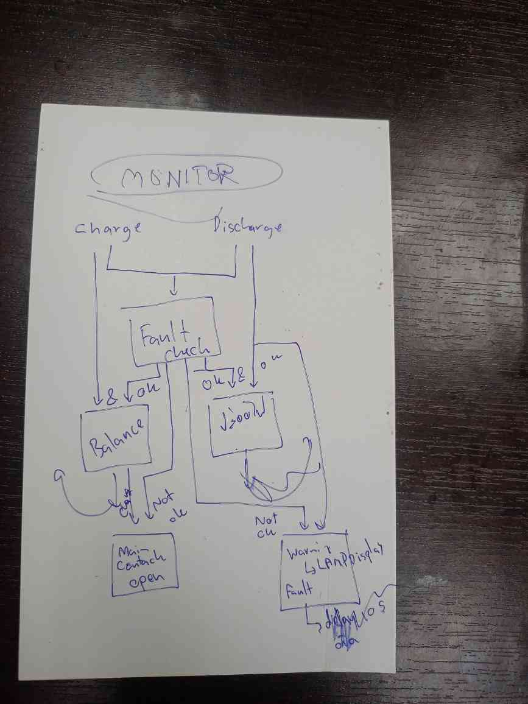

# BMS project
Build by KMUTT BlackPearlRacingteam for BP16 FSAE 2025 competition and onward

##  Proeject structure

###  BMU (Battery management unit)

Monitor cell voltages.
Monitor cell faults.
Sense cell temperature.
Perform cell balancing during charge.

Reference:
BMU Board: (Custom, based on Linduino <!-- [link to Linduino purchase] -->)
Sketch code : Reference from Linduino repo, LTsketchbook folder <!-- [Link to Linduino github page] ltsketchbook section -->

###  BCU (Battery control unit)

YSS ESP32 custom board, here's the link to this the schematic repository
the board contains x relay driver to drive the shutdown circuit relay
xx input GPIO to sense the signal from Shutdown circuit
xx input GPIO
ESP32 CAN controller (TWAI) and CAN TJA1050 tranceiver

Controls Communication via CAN Bus internal to BMS subsystem
Coordinate with safety circuit
Aggregate data from BMS and Safety circuit to Telemetry system

<!-- add insert to block diagram-->

###  Electrical system Communication agreement
Checkout this spreadsheet for how BMS interact with other subsystem  
How various data are aggregated and handle to Telemetry System that will make use of it the most.
https://1drv.ms/x/c/d079ad5b2828ff79/EcjwKipZkZRGtMpphnwD8aABigw9Ukt2hv3MfdNIQ77VwQ?e=KX4nT4

 
 
BMU Module Report , BMU individual cell report (2 monitoring message per module) (200ms cycle)
Message reception sequencing :: 200 ms / 8  = 25 ms / module
Each module will have its own algorithm to calculate the 
time : eg. 200ms/8 * src address ,src add = 0x01-0x08

